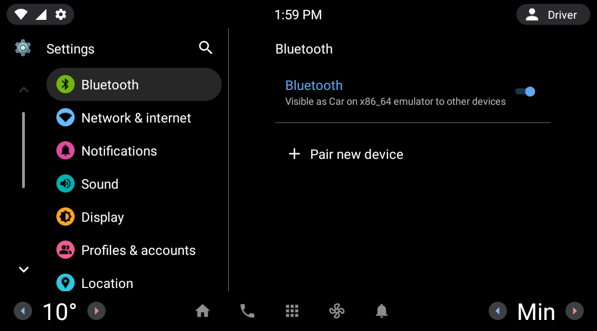
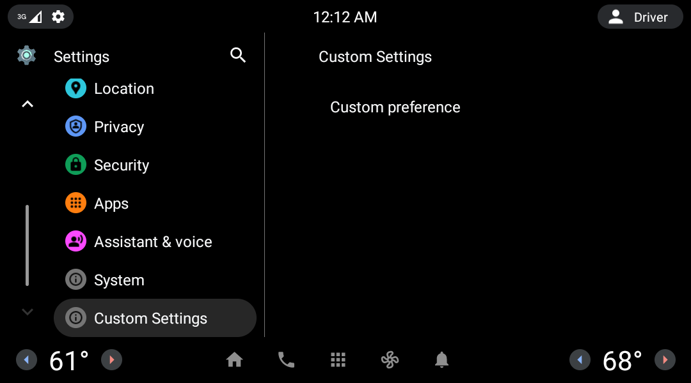

# AOSP Car Settings
CarSettings AOSP (Android 12) exploration and customization. Creating new settings parameters and integrating with the system.<br>
This code is based on the branch *android-12.0.0_r26* from AOSP and located at `packages/apps/Car/Settings`.

## Get started
All the following steps are based on the AOSP documentation pageprovided by Google.<br>
Instructions for setup available at https://source.android.com/setup.
### Requisites
- 64-bit environment (currently using Ubuntu 20.04).
- At least 16 GB of available RAM is required, but Google recommends 64 GB.
- At least 150 GB of free space on the disk.

### Setting up Linux build environment
```
sudo apt-get install git-core gnupg flex bison build-essential zip curl zlib1g-dev gcc-multilib g++-multilib libc6-dev-i386 libncurses5 lib32ncurses5-dev x11proto-core-dev libx11-dev lib32z1-dev libgl1-mesa-dev libxml2-utils xsltproc unzip fontconfig
```

### Getting the source
#### Initializing repo
```
repo init -u https://android.googlesource.com/platform/manifest -b android-12.0.0_r26
```
#### Downloading the AOSP tree
```
repo sync -c -j8
```

### Building Android
Inside the AOSP tree folder, run the following commands:
```
source build/envsetup.sh
lunch sdk_car_x86_64-userdebug
m -j24
```
Note: The -j argument makes the build handles parallel task, the recommended number to pass is the double of processing units that you have in your system. You can get it by the command `nproc` and just multiply this number by 2.

## Exploring CarSettings app
Car Settings is a hero android app located at `packages/apps/Car/Settings`. Google provides the app architecture overview, available at https://source.android.com/devices/automotive/hmi/car_settings.
This is the Car Settings app on AAOS 12 (Android Automotive OS):


## Adding a custom settings item
- Created a custom settings screen.
- Created a custom preference.
- Added the custom settings screen entry in the root hierarchy.

Check the branch [adding_custom_settings](https://github.com/sudoariel/AOSP-CarSettings/tree/adding_custom_settings)


