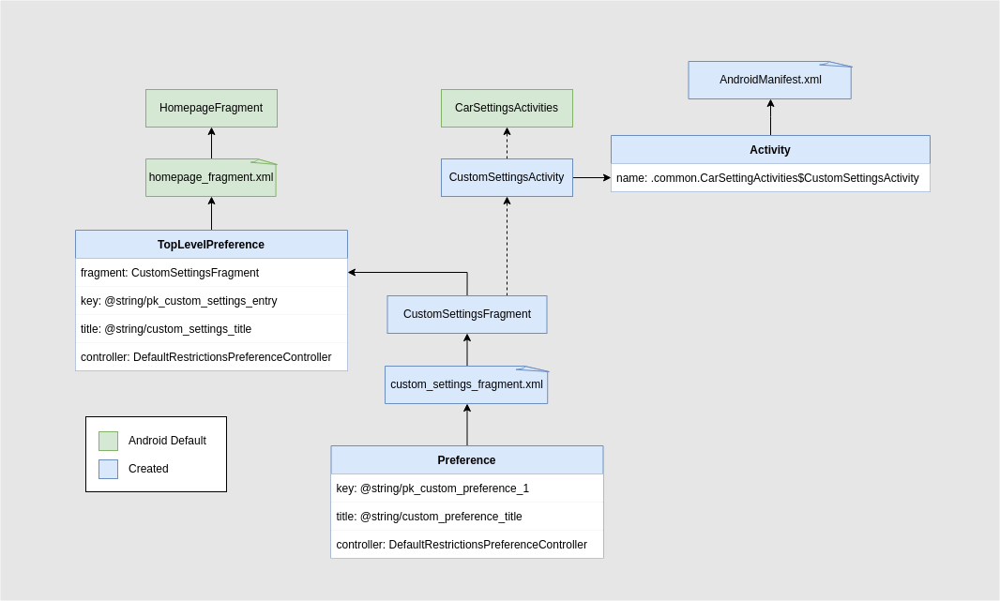

# Adding Custom Settings
Added a custom settings screen in the root hierarchy (`HomepageFragment`). This custom settings screen constains only a custom parameter added.

## Structure

The creation of a new settings screen and parameter was made based on Google documentation available [here](https://source.android.com/devices/automotive/hmi/car_settings/add_car_settings).

## Screenshot

